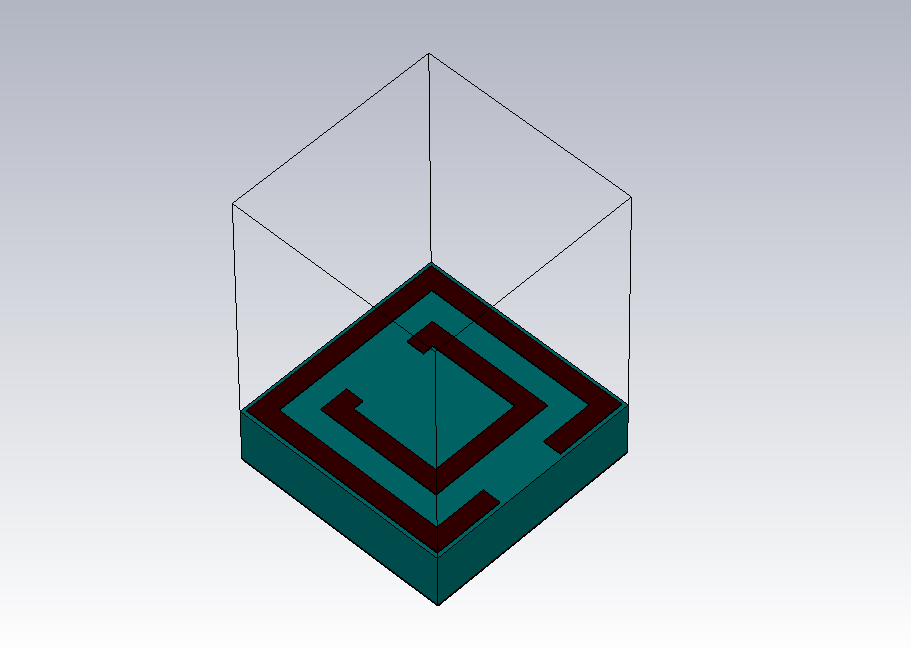
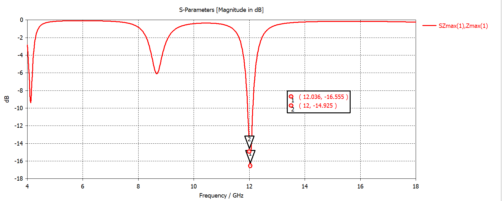
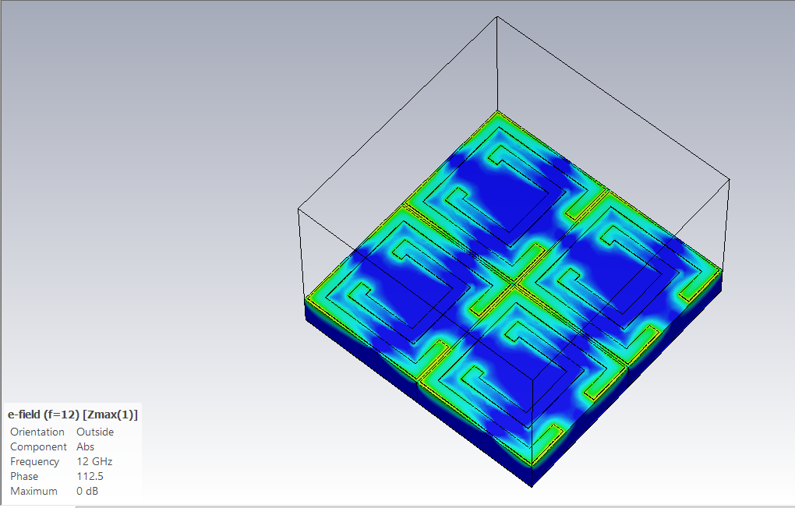

# 12 GHz SRR-Based Metamaterial Absorber

<p align="center">
  <b>Design and Electromagnetic Analysis of a Split-Ring Resonator Based Microwave Absorber</b>
</p>

<p align="center">
  
</p>

## 📌 Overview

This project presents the design and electromagnetic analysis of a **Split-Ring
Resonator (SRR)-based metamaterial absorber** operating around **12 GHz**.

The proposed structure is designed as a compact, subwavelength unit cell for
strong microwave absorption, with potential applications in **Radar Cross
Section (RCS) reduction, electromagnetic absorption, and microwave shielding**.

The electromagnetic behavior of the structure was investigated using
**CST Studio Suite**, including S-parameter analysis, absorption calculation,
surface-current distribution, and electric-field distribution.

The proposed unit cell has a dimension of **6 × 6 mm²**, corresponding to
approximately **0.24λ₀ × 0.24λ₀ at 12 GHz**, while achieving approximately
**96.8% simulated absorption** at the target frequency.

---

## 🎯 Project Objectives

The main objectives of this project are:

- Design a compact SRR-based metamaterial absorber for microwave frequencies.
- Tune the resonant frequency close to **12 GHz**.
- Analyze the reflection and absorption characteristics of the structure.
- Investigate the electromagnetic behavior at resonance.
- Study the surface-current and electric-field distributions.
- Develop a simple and practical geometry suitable for PCB-based fabrication.
- Explore the potential use of the absorber for **RCS reduction and microwave
  absorption applications**.

---

## 📡 Application

The proposed absorber is intended for **microwave absorption** and has potential
application in **Radar Cross Section (RCS) reduction**.

When an electromagnetic wave is incident on a conducting structure, a significant
portion of the energy can be reflected. A metamaterial absorber can reduce this
reflection by introducing a resonant electromagnetic response that absorbs a
large portion of the incident energy.

Potential application areas include:

- Radar cross-section reduction
- Radar absorbing surfaces
- Microwave absorbing structures
- Electromagnetic interference (EMI) suppression
- Microwave shielding
- Electromagnetic compatibility (EMC)
- Educational and laboratory-scale metamaterial research

> **Note:** The present work demonstrates absorption at the unit-cell level.
> Full RCS-reduction performance of a specific object would require additional
> target-level RCS simulations or experimental measurements.

---

# 📐 Design Specifications

| Parameter | Value |
|---|---:|
| Operating frequency | ~12 GHz |
| Unit-cell length | 6 mm |
| Unit-cell width | 6 mm |
| Unit-cell area | 36 mm² |
| Free-space wavelength at 12 GHz | 25 mm |
| Electrical size | ~0.24λ₀ × 0.24λ₀ |
| Substrate | FR-4 |
| Substrate thickness | 1.6 mm |
| Conducting material | Copper |
| Copper thickness | 0.035 mm |
| Inner ring trace width | 1 mm |
| Outer ring trace width | 1 mm |
| Minimum gap feature | 0.5 mm |

---

# 🧩 SRR Geometry

The absorber consists of **nested rectangular split-ring resonators**.

The resonator geometry was parameterized in CST so that the dimensions of the
rings and their capacitive gaps could be independently controlled.

<p align="center">
  
</p>


## Inner Ring

The inner ring is created by subtracting a smaller rectangle from a larger
rectangle.

### Inner ring parameters

- `IPL` = 3.5 mm — Inner Patch Length
- `IPW` = 3.5 mm — Inner Patch Width
- `IPSL` = 2.5 mm — Inner Patch Slot Length
- `IPSW` = 2.5 mm — Inner Patch Slot Width

The resulting ring dimensions are:

### Trace width along length

\[
W_{trace,L} = IPL - IPSL
\]

\[
W_{trace,L} = 3.5 - 2.5 = 1.0\ mm
\]

### Trace width along width

\[
W_{trace,W} = IPW - IPSW
\]

\[
W_{trace,W} = 3.5 - 2.5 = 1.0\ mm
\]

Therefore, the nominal trace width of the inner rectangular ring is:

\[
\boxed{1.0\ mm}
\]

---

## Outer Ring

The outer resonator is generated using the same geometric approach.

### Outer ring parameters

- `OPL` = 5.8 mm — Outer Patch Length
- `OPW` = 5.8 mm — Outer Patch Width
- `OPSL` = 4.8 mm — Outer Patch Slot Length
- `OPSW` = 4.8 mm — Outer Patch Slot Width

The resulting trace width is:

\[
W_{trace,L} = OPL - OPSL
\]

\[
W_{trace,L} = 5.8 - 4.8 = 1.0\ mm
\]

Similarly,

\[
W_{trace,W} = OPW - OPSW
\]

\[
W_{trace,W} = 5.8 - 4.8 = 1.0\ mm
\]

Thus, the outer ring also has a nominal trace width of:

\[
\boxed{1.0\ mm}
\]

---

# ⚡ Capacitive Split Regions

Additional slots are introduced into the SRR structure to create the required
electrical discontinuities and capacitive regions.

### Outer ring

- `OSL` = 1.9 mm — Outer Slot Length
- `OSW` = 0.5 mm — Outer Slot Width

### Inner ring

- `ISL` = 1.9 mm — Inner Slot Length
- `ISW` = 0.5 mm — Inner Slot Width

These split regions introduce strong localized electric fields and contribute
to the effective capacitance of the resonator.

The SRR can therefore be approximately interpreted as an **LC resonant system**:

\[
f_0 \approx \frac{1}{2\pi\sqrt{LC}}
\]

where:

- The conducting current path contributes primarily to the effective inductance.
- The split/gap regions contribute significantly to the effective capacitance.

Changing the resonator dimensions or gap geometry modifies the effective
inductance and capacitance, allowing the resonant frequency to be tuned.

---

# 📏 Unit-Cell Size and Wavelength

At the target frequency of 12 GHz, the free-space wavelength is:

\[
\lambda_0 = \frac{c}{f}
\]

\[
\lambda_0 =
\frac{3\times10^8}{12\times10^9}
=25\ mm
\]

The unit-cell dimension is 6 mm.

Therefore:

\[
\frac{6}{25}=0.24
\]

Thus, the unit cell has an electrical size of approximately:

\[
\boxed{0.24\lambda_0 \times 0.24\lambda_0}
\]

The 6 × 6 mm² structure therefore remains **subwavelength at 12 GHz**.

---

# 🖥️ Simulation Setup

The structure was modeled and simulated using:

**CST Studio Suite**

The simulation uses periodic boundary conditions to represent a periodic
array of the proposed unit cell.

### Simulation components

- Unit-cell boundary conditions
- Floquet-port excitation
- Continuous metallic ground plane
- S-parameter extraction
- Frequency-domain electromagnetic analysis
- Surface-current monitor
- Electric-field monitor

<p align="center">
  
</p>

### Floquet-Port / Boundary Setup

The periodic boundary configuration allows the electromagnetic response of
the unit cell to be analyzed as part of an infinite periodic structure.

The Floquet port is used to excite the periodic structure and obtain its
reflection and transmission characteristics.

---

# 📊 Absorption Calculation

The absorption coefficient is calculated from the simulated S-parameters:

\[
A(f)=1-R(f)-T(f)
\]

where:

\[
R(f)=|S_{11}|^2
\]

and

\[
T(f)=|S_{21}|^2
\]

Because the structure contains a continuous metallic ground plane, transmission
through the structure is strongly suppressed:

\[
T \approx 0
\]

Therefore, the absorption can approximately be expressed as:

\[
A(f)\approx1-|S_{11}|^2
\]

This allows the absorption performance to be directly related to the simulated
reflection coefficient.

---

# 📈 Simulation Results

The proposed structure exhibits a strong resonant response around **12 GHz**.

### Key Results

| Performance Parameter | Simulated Result |
|---|---:|
| Target frequency | ~12 GHz |
| Absorption at 12 GHz | **~96.8%** |
| S11 at 12 GHz | **−14.93 dB** |
| Minimum S11 | **−16.56 dB** |
| Frequency of minimum S11 | **12.036 GHz** |
| Reflection at 12 GHz | **~3.2%** |

---

## S11 / Reflection Response

<p align="center">
  
</p>

The reflection coefficient reaches a minimum around the designed operating
frequency, indicating strong interaction between the incident electromagnetic
wave and the resonant SRR structure.

At approximately 12 GHz:

\[
S_{11}\approx-14.93\ dB
\]

The corresponding reflected power is approximately:

\[
R=10^{S_{11}/10}
\]

\[
R=10^{-14.93/10}\approx0.032
\]

Therefore, approximately **3.2% of the incident power is reflected** at this
frequency.

---

# 📉 Reflectance and Absorption

<p align="center">
  
</p>

The simulated absorption reaches approximately:

\[
\boxed{96.8\%}
\]

at 12 GHz.

This high absorption results from the combination of:

- Strong SRR resonance
- Reduced reflection
- Suppressed transmission due to the metallic ground plane
- Localized electromagnetic fields
- Resonant current distribution

---

# 🧲 Surface-Current Distribution

<p align="center">
  
</p>

The surface-current distribution at the resonant frequency shows strong current
concentration along the SRR conducting paths.

The circulating current around the resonator indicates strong excitation of the
resonant mode.

The current distribution provides physical evidence that the SRR geometry is
responsible for the strong electromagnetic interaction near the operating
frequency.

---

# ⚡ Electric-Field Distribution

<p align="center">
  
</p>

The electric-field distribution shows strong field localization around the
split/gap regions of the SRR.

These regions contribute significantly to the effective capacitance of the
resonator.

The combination of the inductive current path and capacitive split regions
produces an LC-type resonance close to the designed operating frequency.

---

# 🔬 Electromagnetic Absorption Mechanism

The absorption mechanism can be summarized as:

```text
Incident Microwave
       │
       ▼
  SRR Resonance
       │
       ▼
Localized Electric Field
       │
       ▼
Resonant Surface Current
       │
       ▼
Reduced Reflection
       │
       ▼
Strong Microwave Absorption
```

At resonance, the SRR structure interacts strongly with the incident
electromagnetic wave.

The split regions provide effective capacitance, while the current paths
provide effective inductance. The resulting LC resonance produces a strong
electromagnetic response around 12 GHz.

The continuous ground plane suppresses transmission, allowing a large portion
of the incident electromagnetic energy to be absorbed rather than transmitted.

---

# 🏭 Fabrication Considerations

An important aspect of the proposed design is its relatively straightforward
planar geometry.

The structure uses:

- Standard FR-4 substrate
- Copper metallization
- Planar SRR geometry
- No vias
- No lumped components
- No active components
- 1 mm nominal SRR trace width
- 0.5 mm minimum gap feature

This makes the design suitable for **PCB-based fabrication and low-cost
prototyping**.

The practical geometry can also make the structure useful for educational
laboratories and student-level experimental work involving microwave
metamaterials and electromagnetic absorbers.

> Fabrication feasibility should ultimately be validated experimentally by
> manufacturing the structure and characterizing its response.

---

# 🌐 Potential Applications

The strong absorption around 12 GHz makes the structure potentially relevant
to:

### Radar Cross-Section Reduction

Metamaterial absorbers can be incorporated into surfaces to reduce reflected
microwave energy and therefore potentially contribute to radar cross-section
reduction.

### Microwave Absorption

The structure can be used as a frequency-selective microwave absorbing
element.

### EMI/EMC Applications

The absorber concept can be explored for electromagnetic interference
suppression and electromagnetic compatibility applications.

### Microwave Shielding

The structure may also be investigated as a frequency-selective absorbing
surface for microwave shielding applications.

---

# 🛠️ Tools Used

- **CST Studio Suite**
- Electromagnetic simulation
- Floquet-port analysis
- S-parameter analysis
- Metamaterial absorber design
- Surface-current analysis
- Electric-field analysis
- Parametric geometry modeling

---

# 📋 Complete Parameter Table

| Parameter | Description | Value |
|---|---|---:|
| UCL | Unit Cell Length | 6 mm |
| UCW | Unit Cell Width | 6 mm |
| IPL | Inner Patch Length | 3.5 mm |
| IPW | Inner Patch Width | 3.5 mm |
| IPSL | Inner Patch Slot Length | 2.5 mm |
| IPSW | Inner Patch Slot Width | 2.5 mm |
| ISL | Inner Slot Length | 1.9 mm |
| ISW | Inner Slot Width | 0.5 mm |
| OPL | Outer Patch Length | 5.8 mm |
| OPW | Outer Patch Width | 5.8 mm |
| OPSL | Outer Patch Slot Length | 4.8 mm |
| OPSW | Outer Patch Slot Width | 4.8 mm |
| OSL | Outer Slot Length | 1.9 mm |
| OSW | Outer Slot Width | 0.5 mm |
| MT | Copper Thickness | 0.035 mm |
| ST | Substrate Thickness | 1.6 mm |

---

# 📌 Summary of Results

The proposed SRR-based metamaterial absorber demonstrates:

- **12 GHz operating frequency**
- **6 × 6 mm² subwavelength unit cell**
- **~0.24λ₀ electrical size**
- **~96.8% simulated absorption**
- **−14.93 dB reflection at 12 GHz**
- **−16.56 dB minimum S11 at 12.036 GHz**
- Strong surface-current concentration at resonance
- Strong electric-field localization around the SRR gaps
- PCB-compatible planar architecture
- Potential application in **microwave absorption and RCS reduction**

---

# 🚀 Future Work

The following investigations can be carried out to further develop the design:

1. Fabricate the absorber using PCB fabrication techniques.
2. Experimentally characterize the fabricated structure using a Vector Network
   Analyzer (VNA).
3. Compare simulated and measured S-parameters.
4. Investigate the effect of fabrication tolerances on the resonant frequency.
5. Perform parametric analysis of SRR dimensions and capacitive gaps.
6. Investigate polarization and incident-angle stability.
7. Study the response of finite arrays instead of an ideal infinite periodic
   structure.
8. Evaluate actual RCS reduction using a defined target geometry.
9. Investigate bandwidth enhancement using modified SRR geometries.
10. Explore multi-band and broadband absorber configurations.

---

# 📚 Project Status

**Status:** Completed simulation and electromagnetic analysis

**Simulation:** CST Studio Suite

**Operating Frequency:** ~12 GHz

**Simulated Absorption:** ~96.8%

**Primary Application:** Microwave absorption / potential RCS reduction

---

## 👩‍💻 Author

**Arya**

Electronics and Communication Engineering

---

<p align="center">
  <i>SRR-based metamaterial absorber designed and analyzed using CST Studio Suite.</i>
</p>
